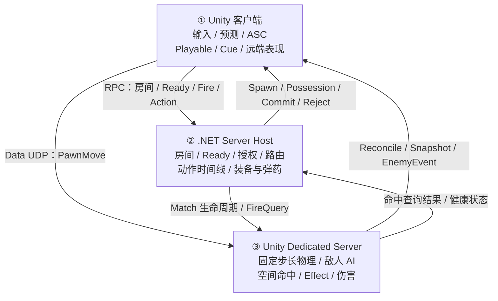

# FPSDemo

一个基于 Unity 2022.3 的第三人称多人 PVE 射击项目。它关注的不是单机演示，而是把“玩家操作、角色物理、程序化动画、武器能力、专用服务器权威模拟与客户端表现”接成一条可验证的主链路。

## 整体架构



**职责边界**：客户端负责输入、即时预测和表现；Unity Dedicated Server 持有空间物理、敌人 AI、命中与运行时伤害事实；独立 .NET Server Host 负责房间、连接授权、消息路由、动作时间线以及装备/弹药状态。

## 项目亮点

- **Dedicated Server 权威战斗**：Unity Dedicated Server 负责玩家物理、敌人导航/感知/巡逻、空间命中与伤害效果；.NET Server Host 维护权威装备/弹药和动作时序；客户端不运行敌人 AI，也不拥有最终战斗结果。
- **预测与回滚式移动同步**：本地拥有者立即保存并预测移动输入，服务端发布权威快照与校正；远端玩家只消费快照插值，避免多端重复模拟。
- **完整的开火与换弹协议**：Owner 以 `PredictionNonce` 做一次预测播放；服务端单独提交弹药、命中和伤害；`FireCommitted` 驱动远端的后坐力、枪口效果和命中表现。
- **三敌人 PVE 闭环**：固定 roster 的手枪、步枪与 AK 敌人拥有稳定 ID；服务端执行巡逻、感知、追击、掩体回撤和开火，客户端以 `EnemySpawned`、`EnemySnapshot`、`EnemyAction` 还原位置、动画与特效。
- **数据驱动玩法装配**：`GameBootstrap` 组装 World 子系统、资源、输入、GameplayTag、GameplayCue、武器目录和网络配置；`LevelRuntime`、`GameMode`、`GameState/Experience` 按生命周期装配正式玩法。

## GameplayTag、ASC 与 GameplayCue

这三套机制分别解决“用什么语义描述玩法”“由谁执行玩法规则”“怎样触发表现”，并保持单向依赖：Tag 描述语义，ASC 执行 Ability/Effect，Cue 消费已经产生的表现事件。

```text
InputAction
  -> InputTag.Weapon.*
  -> PawnHeroComponent
  -> AbilitySystemComponent
  -> Ability / GameplayEffect
  -> GameplayCue.*
  -> GameplayCueManager
  -> 动画、特效、声音与命中反馈
```

| 机制 | 当前实现职责 |
| --- | --- |
| `GameplayTag` | 从配置源构建注册表，支持父子层级匹配；输入绑定必须使用已注册的显式叶子 Tag，PlayMode/Build 前会检查无效或未迁移引用。 |
| `AbilitySystemComponent`（ASC） | 区分 Owner 与 Avatar，保存 AbilitySpec、AbilitySet 授予回执、AttributeSet、OwnedTag 和输入状态；负责 Ability 激活/结束以及 GameplayEffect 的构建、校验和提交。 |
| `GameplayEffect` | 将属性修改先构造成执行计划，确认目标属性和上下文有效后再提交；提交成功后触发配置的 Cue。 |
| `GameplayCue` | `GameplayCueManager` 作为 WorldSubSystem 随 World 注册/注销路由；支持一次性 `Execute` 和带 Handle 的 `Add/Remove`，并按 Tag 从叶子向父级查找 Notify。 |

ASC 不直接承担网络复制。联网模式同步的是服务端确认后的移动状态、动作、弹药、命中和伤害结果；客户端收到结果后，再让 ASC、Presenter、Playable 与 GameplayCue 收敛到权威事实。

## 核心运行链路

### 1. 玩法启动与角色生成

```text
GameBootstrap
  -> World / LevelRuntime
  -> GameMode + GameState + Experience
  -> Controller / PlayerState / Pawn
  -> GameplayReady
```

`GameBootstrap` 统一创建世界与玩家子系统；世界、关卡和 Experience 就绪后，正式进入 Pawn 生成与 `GameplayReady`。这将玩法装配与具体角色、地图资源解耦，避免在场景脚本中隐式初始化核心系统。

### 2. 输入、物理与动画

```text
Unity Input System
  -> InputSubSystem / PlayerController
  -> Pawn control intent
  -> CharacterPhysicsSubSystem
  -> CharacterAnimInstance / AnimationGraphContext
  -> Playable nodes -> Animator
```

输入层只产生控制意图，角色物理系统消费命令并生成稳定帧状态；动画图再读取物理结果输出姿势。这样 Root Motion 只写入动画上下文，由上层决定是否交给移动系统消费，动画层不会直接修改 Transform。

### 3. 多人权威同步

```text
Local owner: input -> local prediction -> server request
Dedicated Server: validate -> fixed-step simulation -> authority snapshot / commit
Remote client: snapshot interpolation + committed action presentation
```

本地玩家追求操作即时性，服务端保留最终世界事实，远端玩家专注稳定表现。移动、射击、弹药和伤害都遵循这条职责边界；客户端的表现事件最终会收敛到服务端提交或拒绝结果。

### 4. 敌人 AI 与表现

```text
Dedicated Server tick
  -> patrol / perception / cover / fire
  -> GameplayEffect + EnemyAction
  -> EnemySpawned / EnemySnapshot / EnemyAction
  -> EnemyPresentationRegistry + GameplayCue / Playables
```

敌人空间模拟、导航和伤害只在 Dedicated Server 发生。客户端的 `EnemyPresentationRegistry` 根据快照插值位置，根据 Action 播放开火、受击和死亡表现；死亡立即释放表现对象，不引入客户端尸体、复活或对象池的额外权威分歧。

## 网络同步设计

### UDP、LiteNetLib 与 MessagePack

项目使用 **LiteNetLib 构建 UDP 通信层**，使用 MessagePack 序列化协议消息。UDP 让高频状态不必等待丢失的旧包；LiteNetLib 则在 UDP 之上提供按消息选择的可靠性与顺序语义，因此连续状态和离散事务可以采用不同策略。

| 消息类别 | 传输语义 | 设计原因 |
| --- | --- | --- |
| `PawnMove`、`OwnerReconcile`、`AuthoritySnapshot` | `UnreliableSequenced` | 高频发送，只需要最新 Tick；迟到的旧移动和旧快照没有继续处理的价值。 |
| 房间、Ready、Pawn 生成与 Possession | `ReliableOrdered` | 影响身份和生命周期，不能丢失或乱序。 |
| `FireRequest`、`FireCommitted`、`FireRejected` | `ReliableOrdered` | 开火会改变弹药、命中和伤害，是必须去重并获得最终结论的离散事务。 |
| 动画 Action 的 Started/Committed/Ended/Cancelled | `ReliableOrdered` | 离散动作必须保持 `ActionSequence` 顺序，终止事件不能先于开始事件。 |
| `EnemySpawned`、`EnemyAction` | `ReliableOrdered` | 敌人身份与关键表现事件不可丢失。 |
| `EnemySnapshot` | 最新状态优先 | 客户端按 `authorityServerTick` 消费并插值，不预测敌人 AI。 |

### 物理同步链路

```text
Owner InputSubSystem / Pawn
  -> 本地固定步长物理
  -> 保存 PawnMove（Sequence + ClientTick + 量化输入/视角）
  -> UDP UnreliableSequenced
  -> Dedicated Server 校验身份、PossessionRevision、Sequence
  -> 服务端固定步长 CharacterPhysicsSubSystem
  -> OwnerReconcile + AuthoritySnapshot
  -> Owner：Ack 清理历史；Correction 回到权威状态并重放未确认 Move
  -> Remote：按 ServerTick 缓冲并插值，不执行本地输入预测
```

输入层只提交控制意图，最终位移来自角色物理。Owner 预测保证手感，服务端快照保证一致性；量化后的输入、视角、位置、速度、接地状态和控制旋转降低带宽并形成可审计的权威帧。

### Fire 同步链路

```text
InputTag.Weapon.Fire
  -> ASC / Fire Ability
  -> NetworkFireBridge 创建 PredictionNonce + ClientShotSequence
  -> Owner 立即播放一次后坐力、枪口与动画表现
  -> FireRequest（ReliableOrdered）
  -> .NET Server Host 校验 Pawn、PossessionRevision、射速、装备与弹药
  -> Unity Dedicated Server 执行空间命中查询与运行时伤害
  -> AuthorityFireProcessor 分配 ShotSequence，提交权威弹药与 Impact
  -> FireCommitted 或 FireRejected（ReliableOrdered）
  -> Owner：按 PredictionNonce 确认或撤销，并覆盖权威弹药
  -> Remote：按 ShotSequence 去重，只从 FireCommitted 重建表现
```

`PredictionNonce` 关联本地预测与服务端结论，`ClientShotSequence` 保证请求幂等，服务端 `ShotSequence` 标识最终射击事实。独立的 Recoil 或动画表现不能扣除权威弹药，也不能自行生成命中与伤害。

### 动画同步链路

动画同步分为两类：移动等连续状态来自权威物理快照；换弹、切枪、近战和离散射击动作使用可靠的 Action 协议。

```text
连续动画：AuthoritySnapshot
  -> RemoteSnapshotBuffer
  -> CharacterPhysicsFrameData / RemoteAnimationState
  -> CharacterAnimInstance
  -> AnimationGraphContext
  -> Playable Nodes -> Animator

离散动作：ASC / Ability
  -> Owner BeginPredicted(PredictionNonce)
  -> AnimationActionRequest
  -> Server ActionSequence + ServerStartTick + DurationTicks
  -> Started / Committed / Ended / Cancelled
  -> Owner：复用预测 Handle，确认时不重复播放
  -> Remote：按服务端时间补偿 elapsedTicks 后播放
  -> 终止事件停止对应 ActionSequence
```

`NetworkAnimationActionBridge` 同时记录已观察、已终止和已拒绝的序列，防止重包、晚包或拒绝后的预测再次播放。动画层只消费稳定角色状态和已确认动作，不直接读取网络包或设备输入。

## Harness 开发与验收流程

Harness 将“设计—任务—执行—Review—Debug—验收”串成分支隔离、证据可追溯的闭环：

```text
brainstorming：确认目标、边界和验收标准
  -> 任务文档 / writing-plans：拆成可独立验证的纵向 feature
  -> resolve-feature-list：解析当前 Git 分支的唯一任务清单
  -> incremental implementation：一次只推进一个 in_progress feature
  -> 最窄测试 + 正式入口验证
  -> .harness/runs/<feature>-<timestamp>/result.json
  -> code review：分别检查 Standards 与 Spec
  -> systematic debugging：区分环境、测试、实现和外部 blocker
  -> validate-feature-evidence：核验 schema-v2、能力覆盖与风险记录
  -> 提交前全量 Unity EditMode / PlayMode + Server NUnit + Git 范围审计
```

仓库内的 `Harness/` 只保留可复用脚本；分支任务清单、日志、截图、录屏、测试报告和 `result.json` 都生成到被忽略的 `Harness/.harness/`。历史记忆与 `session-handoff` 只用于帮助定位，当前分支清单、当前源码和本轮运行结果始终拥有更高事实优先级。

## 测试与 CI

测试流程分成开发期验证、本地提交门禁和 GitHub Actions 三层。三者证明的范围不同：局部测试用于快速反馈，全量测试用于阻止带回归的提交，CI 用于在远端复现仓库规则和已配置的自动化检查。

### 开发期测试

```text
修改一个 feature
  -> 运行受影响模块的最窄 EditMode / PlayMode / NUnit 测试
  -> 需要交互或视觉结果时，从正式 SampleScene 与 GameBootstrap 验证
  -> 将本轮命令、结果、风险和运行证据写入 result.json
  -> validate-feature-evidence.ps1 -FeatureId <feature-id>
```

开发期不默认运行整个项目，也不能用孤立单元测试替代正式入口。涉及输入、联网、动画或玩家可见结果时，验收必须覆盖对应的真实链路。

### 本地提交前全量门禁

```text
Unity EditMode 全部用例
  -> Unity PlayMode 全部用例
  -> Server/tests 下 5 个 NUnit 测试项目
  -> 当前 feature 的证据门禁
  -> git diff --check + staged / unstaged / untracked 范围审计
  -> 只精确暂存本任务文件
```

服务端测试覆盖 `Fps.Protocol.Tests`、`Fps.ServerDomain.Tests`、`Fps.ServerNet.Tests`、`Fps.ClientNet.Tests` 和 `Fps.ServerHost.Tests`。只有本轮实际执行的命令和结果可以写成通过；历史 passing、已有代码或局部测试均不能替代本次全量门禁。

### GitHub Actions

仓库现有两个启用的 Workflow：

| Workflow | 触发条件 | 当前职责 |
| --- | --- | --- |
| `Project CI` | 推送到 `main`、面向 `main` 的 PR、手动触发 | 检出 Git LFS；检查禁止跟踪的目录、`Packages/manifest.json` 和 Unity 版本；按配置运行 Unity EditMode/PlayMode；上传测试产物并生成 CI Summary。 |
| `AI Code Review` | 非 Draft PR 的创建、更新、重新打开或转为 Ready；也可手动触发 | 检出目标 Diff，调用仓库内 AI Reviewer，并将审查结果写回 PR。 |

```text
Push / Pull Request
  -> Repository checks
  -> Unity EditMode + PlayMode（仅 ENABLE_UNITY_CI=true 时）
  -> 上传测试 artifacts
  -> CI summary

Non-draft Pull Request
  -> AI Code Review
  -> PR review comment
```

当前 CI 边界需要明确：Unity 测试默认受仓库变量 `ENABLE_UNITY_CI` 控制，并依赖 `UNITY_LICENSE`、`UNITY_EMAIL`、`UNITY_PASSWORD`；AI Review 依赖相应 API Key；5 个服务端 NUnit 项目目前仍属于本地提交前门禁，尚未接入 `Project CI`。此外，Workflow 中声明的 Unity 补丁版本必须与 `ProjectSettings/ProjectVersion.txt` 保持一致，否则仓库规则检查会直接失败。

CI 页面反映远端自动化的实时结果，Harness 的 `result.json` 反映具体 feature 的验收证据；两者互补，任何一方都不能自动证明另一方已经通过。

## 模块地图

| 模块 | 职责 |
| --- | --- |
| `Assets/Script/3C` | 输入、Controller/Pawn、角色物理与相机控制边界。 |
| `Assets/Script/Animation` | CharacterAnimationGraph、Playable 节点与程序化角色/武器表现。 |
| `Assets/Script/GameMode` | World、LevelRuntime、GameMode、Experience 与玩法生命周期。 |
| `Assets/Script/Ability` | GameplayTag、Ability、GameplayCue、GameplayEffect 与装备动作。 |
| `Assets/Script/Network` | 客户端连接、移动预测、状态校正、开火协议和 Dedicated Server 运行时。 |
| `Server/` | 独立 .NET 服务端宿主，承担房间、连接、授权与消息转发边界。 |
| `Harness/` | 随仓库分发的精简验证入口：特性证据校验与双客户端权威快照比对。 |

## 技术栈

- Unity 2022.3.62f3 / C#
- Unity Input System、Cinemachine、Animation Rigging、Playable API
- URP、YooAsset、MessagePack、LiteNetLib
- Unity Dedicated Server + 独立 .NET Server Host
- NUnit、PowerShell 验证 Harness

## 运行与验证

1. 使用 Unity Hub 以 **Unity 2022.3.62f3** 打开项目根目录。
2. 从正式 SampleScene 与 `GameBootstrap` 进入游戏流程；网络场景需要按项目配置启动 Dedicated Server 与 `Server/Fps.ServerHost`。
3. 开发验证可使用 [Harness/README.md](Harness/README.md) 中的 PowerShell 入口。该工具只生成本地状态和证据，不会把运行产物提交到 Git。

## 项目定位

本仓库用于展示一个游戏客户端/联网玩法项目如何划分职责边界，并将其落实到可运行的链路：输入不直接控制物理与动画，客户端不持有服务端战斗事实，表现层不反向修改权威状态。欢迎从上述模块地图和四条主链路开始阅读。
