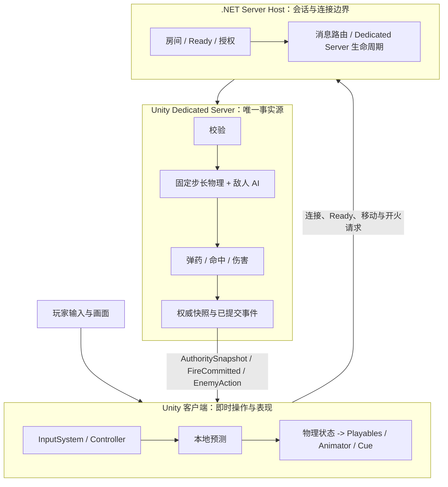

# FPSDemo

一个基于 Unity 2022.3 的第三人称多人 PVE 射击项目。它关注的不是单机演示，而是把“玩家操作、角色物理、程序化动画、武器能力、专用服务器权威模拟与客户端表现”接成一条可验证的主链路。

## 整体架构



**职责边界**：客户端负责输入、即时预测和表现；Dedicated Server 是物理、AI 与战斗结果的唯一事实源；独立 .NET Server Host 负责房间、连接授权和消息转发。

## 项目亮点

- **Dedicated Server 权威战斗**：Unity Dedicated Server 负责玩家物理、敌人导航/感知/巡逻、射击判定、伤害与生命状态；客户端不运行敌人 AI，也不拥有最终命中结果。
- **预测与回滚式移动同步**：本地拥有者立即保存并预测移动输入，服务端发布权威快照与校正；远端玩家只消费快照插值，避免多端重复模拟。
- **完整的开火与换弹协议**：Owner 以 `PredictionNonce` 做一次预测播放；服务端单独提交弹药、命中和伤害；`FireCommitted` 驱动远端的后坐力、枪口效果和命中表现。
- **三敌人 PVE 闭环**：固定 roster 的手枪、步枪与 AK 敌人拥有稳定 ID；服务端执行巡逻、感知、追击、掩体回撤和开火，客户端以 `EnemySpawned`、`EnemySnapshot`、`EnemyAction` 还原位置、动画与特效。
- **数据驱动玩法装配**：`GameBootstrap` 组装 World 子系统、资源、输入、GameplayTag、GameplayCue、武器目录和网络配置；`LevelRuntime`、`GameMode`、`GameState/Experience` 按生命周期装配正式玩法。

## 核心运行链路

### 1. 玩法启动与角色生成

```text
GameBootstrap
  -> World / LevelRuntime
  -> GameMode + GameState + Experience
  -> Controller / PlayerState / Pawn
  -> GameplayReady
```

`GameBootstrap` 统一创建世界与玩家子系统；世界、关卡和 Experience 就绪后，正式进入 Pawn 生成与 `GameplayReady`。这将玩法装配与具体角色、地图资源解耦，避免在场景脚本中隐式初始化核心系统。

### 2. 输入、物理与动画

```text
Unity Input System
  -> InputSubSystem / PlayerController
  -> Pawn control intent
  -> CharacterPhysicsSubSystem
  -> CharacterAnimInstance / AnimationGraphContext
  -> Playable nodes -> Animator
```

输入层只产生控制意图，角色物理系统消费命令并生成稳定帧状态；动画图再读取物理结果输出姿势。这样 Root Motion 只写入动画上下文，由上层决定是否交给移动系统消费，动画层不会直接修改 Transform。

### 3. 多人权威同步

```text
Local owner: input -> local prediction -> server request
Dedicated Server: validate -> fixed-step simulation -> authority snapshot / commit
Remote client: snapshot interpolation + committed action presentation
```

本地玩家追求操作即时性，服务端保留最终世界事实，远端玩家专注稳定表现。移动、射击、弹药和伤害都遵循这条职责边界；客户端的表现事件最终会收敛到服务端提交或拒绝结果。

### 4. 敌人 AI 与表现

```text
Dedicated Server tick
  -> patrol / perception / cover / fire
  -> GameplayEffect + EnemyAction
  -> EnemySpawned / EnemySnapshot / EnemyAction
  -> EnemyPresentationRegistry + GameplayCue / Playables
```

敌人空间模拟、导航和伤害只在 Dedicated Server 发生。客户端的 `EnemyPresentationRegistry` 根据快照插值位置，根据 Action 播放开火、受击和死亡表现；死亡立即释放表现对象，不引入客户端尸体、复活或对象池的额外权威分歧。

## 模块地图

| 模块 | 职责 |
| --- | --- |
| `Assets/Script/3C` | 输入、Controller/Pawn、角色物理与相机控制边界。 |
| `Assets/Script/Animation` | CharacterAnimationGraph、Playable 节点与程序化角色/武器表现。 |
| `Assets/Script/GameMode` | World、LevelRuntime、GameMode、Experience 与玩法生命周期。 |
| `Assets/Script/Ability` | GameplayTag、Ability、GameplayCue、GameplayEffect 与装备动作。 |
| `Assets/Script/Network` | 客户端连接、移动预测、状态校正、开火协议和 Dedicated Server 运行时。 |
| `Server/` | 独立 .NET 服务端宿主，承担房间、连接、授权与消息转发边界。 |
| `Harness/` | 随仓库分发的精简验证入口：特性证据校验与双客户端权威快照比对。 |

## 技术栈

- Unity 2022.3.62f3 / C#
- Unity Input System、Cinemachine、Animation Rigging、Playable API
- URP、YooAsset、MessagePack、LiteNetLib
- Unity Dedicated Server + 独立 .NET Server Host
- NUnit、PowerShell 验证 Harness

## 运行与验证

1. 使用 Unity Hub 以 **Unity 2022.3.62f3** 打开项目根目录。
2. 从正式 SampleScene 与 `GameBootstrap` 进入游戏流程；网络场景需要按项目配置启动 Dedicated Server 与 `Server/Fps.ServerHost`。
3. 开发验证可使用 [Harness/README.md](Harness/README.md) 中的 PowerShell 入口。该工具只生成本地状态和证据，不会把运行产物提交到 Git。

## 项目定位

本仓库用于展示一个游戏客户端/联网玩法项目如何划分职责边界，并将其落实到可运行的链路：输入不直接控制物理与动画，客户端不持有服务端战斗事实，表现层不反向修改权威状态。欢迎从上述模块地图和四条主链路开始阅读。
